# Architecture — RAG Pipeline (Day 08 Lab)

> **Tác giả (Documentation Owner):** Nguyễn Anh Đức (M6)
> **Cập nhật lần cuối:** 14/04/2026

---

## 1. Tổng quan kiến trúc

```
[Raw Docs — 5 policy files]
    ↓
[index.py: Preprocess → Chunk → Embed → Store]
    ↓
[ChromaDB Vector Store (PersistentClient)]
    ↓  ← Dense Query / Hybrid (BM25 + Dense) / Rerank
[rag_answer.py: Query → Retrieve → (Rerank) → Generate]
    ↓
[Grounded Answer + Citation [1][2][3]]
    ↓
[eval.py: Scorecard (4 metrics) → A/B Compare → Report]
```

**Mô tả hệ thống:**
Nhóm xây trợ lý nội bộ cho **khối CS + IT Helpdesk** phục vụ nhân viên tra cứu chính sách nội bộ (hoàn tiền, SLA ticket, phân quyền, nghỉ phép, FAQ IT). Hệ thống sử dụng kiến trúc RAG (Retrieval-Augmented Generation): retrieve đúng đoạn văn từ 5 tài liệu nội bộ trước, sau đó mới để LLM sinh câu trả lời — đảm bảo câu trả lời có trích dẫn nguồn và không ảo giác (hallucination).

---

## 2. Indexing Pipeline (Sprint 1)

### Tài liệu được index

| File | Nguồn (source metadata) | Department | Số chunk |
|------|------------------------|------------|---------|
| `policy_refund_v4.txt` | policy/refund-v4.pdf | CS | 4 |
| `sla_p1_2026.txt` | support/sla-p1-2026.pdf | IT | 3 |
| `access_control_sop.txt` | it/access-control-sop.md | IT Security | 5 |
| `it_helpdesk_faq.txt` | support/helpdesk-faq.md | IT | 6 |
| `hr_leave_policy.txt` | hr/leave-policy-2026.pdf | HR | 3 |

### Quyết định chunking

| Tham số | Giá trị | Lý do |
|---------|---------|-------|
| Chunk size | 512 tokens | Tối ưu hóa cho ngữ cảnh văn bản hành chính/policy, không quá dài để giảm nhiễu. |
| Overlap | 100 tokens | Tránh cắt đứt câu điều khoản quan trọng, duy trì flow ý tưởng giữa các chunk. |
| Chunking strategy | Paragraph-aware / Dấu chấm | Tài liệu policy chia theo điều khoản → split theo ranh giới tự nhiên giữ nguyên ngữ cảnh. |
| Metadata fields | `source`, `section`, `effective_date`, `department`, `access` | Phục vụ filter freshness, citation, audit. |

### Embedding model

- **Model**: OpenAI (`text-embedding-3-small`)
- **Vector store**: ChromaDB (PersistentClient)
- **Similarity metric**: Cosine
- **Số chiều vector**: 1536

---

## 3. Retrieval Pipeline (Sprint 2 + 3)

### Baseline (Sprint 2)

| Tham số | Giá trị |
|---------|---------|
| Strategy | Dense (embedding cosine similarity) |
| Top-k search | 10 |
| Top-k select | 3 |
| Rerank | Không |
| Query transform | Không |

### Variant (Sprint 3)

| Tham số | Giá trị | Thay đổi so với baseline |
|---------|---------|--------------------------|
| Strategy | Hybrid (BM25 + Dense) | Thêm cơ chế tìm kiếm từ khóa |
| Top-k search | 10 | Giữ nguyên |
| Top-k select | 3 | Giữ nguyên |
| Rerank | Rerank bằng LLM (Use_Rerank=True) | Bổ sung module Cross-Encoder / LLM re-rank |
| Query transform | Query Expansion | LLM sinh ra các cách hỏi đồng nghĩa để rải độ bao phủ |

**Lý do chọn variant này:**
> "Chọn hybrid kết hợp vì corpus có cả ngôn ngữ tự nhiên dài (policy) lẫn mã lỗi/keyword chuẩn như ERR-403-AUTH và tên riêng P1 ticket. Dense hay bỏ lỡ exact keyword, nên việc có BM25 (Hybrid) bù đắp cực tốt cho Context Recall."

---

## 4. Generation (Sprint 2)

### Grounded Prompt Template

```
Answer only from the retrieved context below.
If the context is insufficient, say you do not know — do NOT make up information.
Cite the source field when possible using [1], [2], etc.
Keep your answer short, clear, and factual.

Question: {query}

Context:
[1] {source} | {section} | score={score}
{chunk_text}

[2] ...

Answer:
```

**Thiết kế 4 quy tắc chống ảo giác:**
1. **Evidence-only** — `Answer only from the retrieved context`
2. **Abstain** — `Phân định rạch ròi 2 trường hợp: Không có data vs Có chính sách nhưng không đề cập ngoại lệ`.
3. **Citation** — Buộc cite `[1]`, `[2]` từ source metadata.
4. **Exact File Naming** — Ép nhắc đúng tên file mà không tự chèn thêm /path/directory dư thừa.

### LLM Configuration

| Tham số | Giá trị |
|---------|---------|
| Model | gpt-4o-mini |
| Temperature | 0 (để output ổn định, reproducible cho eval) |
| Max tokens | 512 |

---

## 5. Evaluation & Scorecard (Sprint 4)

### 4 Metrics đánh giá

| Metric | Ý nghĩa | Thang điểm |
|--------|---------|-----------|
| **Faithfulness** | Answer có bám đúng retrieved context không? (không bịa) | 1–5 |
| **Answer Relevance** | Answer có trả lời đúng câu hỏi không? (không lạc đề) | 1–5 |
| **Context Recall** | Retriever có lấy về đúng tài liệu cần thiết không? | 1–5 (= recall × 5) |
| **Completeness** | Answer có bao đủ điểm quan trọng so với expected không? | 1–5 |

### A/B Comparison — Kết quả tóm tắt

| Metric | Baseline (dense) | Variant | Delta |
|--------|-----------------|---------|-------|
| Faithfulness | 4.90 /5 | 4.90 /5 | ± 0.00 |
| Answer Relevance | 4.40 /5 | 4.50 /5 | +0.10 |
| Context Recall | 5.00 /5 | 5.00 /5 | ± 0.00 |
| Completeness | 3.70 /5 | 3.90 /5 | +0.20 |

---

## 6. Failure Mode Checklist

> Dùng khi debug — kiểm tra lần lượt: index → retrieval → generation

| Failure Mode | Triệu chứng | Cách kiểm tra |
|-------------|-------------|---------------|
| Index lỗi | Retrieve về docs cũ / sai version | `inspect_metadata_coverage()` trong `index.py` |
| Chunking tệ | Chunk cắt giữa điều khoản, mất ngữ cảnh | `list_chunks()` và đọc text preview |
| Retrieval lỗi | Không tìm được expected source | `score_context_recall()` trong `eval.py` |
| Generation lỗi | Answer không grounded / bịa số liệu | `score_faithfulness()` trong `eval.py` |
| Token overload | Context quá dài → lost in the middle | Kiểm tra độ dài `context_block` |
| Abstain thiếu | Query ngoài vùng dữ liệu nhưng pipeline vẫn trả lời | Test với query `ERR-403-AUTH` |

---

## 7. Pipeline Diagram

```mermaid
graph LR
    A["User Query"] --> B["Query Embedding\n(text-embedding / MiniLM)"]
    B --> C["ChromaDB\nVector Search (Dense)"]
    C --> D["Top-10 Candidates"]
    D --> E{"Retrieval Mode?"}
    E -->|"dense"| G["Top-3 Select"]
    E -->|"hybrid"| BM25["BM25 Sparse Search"]
    BM25 --> RRF["RRF Fusion"]
    RRF --> G
    G --> RERANK{"use_rerank?"}
    RERANK -->|"True"| CE["LLM / Cross-Encoder Rerank"]
    RERANK -->|"False"| CTX["Build Context Block"]
    CE --> CTX
    CTX --> P["Grounded Prompt\nEvidence-only + Abstain + Citation"]
    P --> LLM["LLM\ngpt-4o-mini"]
    LLM --> ANS["Answer + Citation [1][2]"]
    ANS --> EVAL["eval.py\nScorecard + A/B Compare"]
```


