# Architecture — RAG Pipeline (Day 08 Lab)

> **Tác giả (Documentation Owner):** Nguyễn Anh Đức (M6)
> **Cập nhật lần cuối:** 2026-04-13

---

## 1. Tổng quan kiến trúc

```text
[5 policy files trong data/docs]
        ↓
index.py
Preprocess → Chunk theo section/paragraph → Embed → Upsert
        ↓
ChromaDB PersistentClient / collection: rag_lab
        ↓
rag_answer.py
Dense retrieval / Sparse BM25 / Hybrid RRF → (LLM rerank) → Prompt grounded
        ↓
OpenAI gpt-4o-mini
        ↓
Answer + citations + sources
        ↓
eval.py
LLM-as-Judge scorecard → A/B compare → markdown/csv/json logs
```

Hệ thống là một RAG pipeline phục vụ tra cứu chính sách nội bộ cho khối CS, IT Helpdesk, IT Security và HR. Dòng xử lý chính gồm ba tầng:

| Tầng | File chính | Trách nhiệm |
|------|------------|-------------|
| Indexing | `index.py` | Đọc tài liệu, trích metadata, chunk theo section, tạo embedding, lưu vào ChromaDB |
| Retrieval + Generation | `rag_answer.py` | Retrieve candidate chunks, build context block, tạo grounded prompt, gọi LLM trả lời |
| Evaluation | `eval.py` | Chấm 4 metrics, xuất scorecard baseline/variant, tạo file so sánh A/B và grading log |

Mục tiêu thiết kế là giữ câu trả lời bám tài liệu, có trích dẫn, và có thể audit lại theo source/section/effective date.

---

## 2. Indexing Pipeline (Sprint 1)

### Tài liệu được index

Index hiện tại được build từ 5 file `.txt` trong `data/docs`, tương ứng **34 chunks** tổng cộng:

| File | Source metadata | Department | Số chunk |
|------|-----------------|------------|---------:|
| `policy_refund_v4.txt` | `policy/refund-v4.pdf` | CS | 7 |
| `sla_p1_2026.txt` | `support/sla-p1-2026.pdf` | IT | 6 |
| `access_control_sop.txt` | `it/access-control-sop.md` | IT Security | 8 |
| `it_helpdesk_faq.txt` | `support/helpdesk-faq.md` | IT | 7 |
| `hr_leave_policy.txt` | `hr/leave-policy-2026.pdf` | HR | 6 |
| **Tổng** |  |  | **34** |

### Quyết định chunking

| Tham số | Giá trị thực tế | Lý do |
|---------|-----------------|-------|
| Chunk size | `512` tokens ước lượng (`~2048` ký tự) | Giữ đủ một điều khoản/FAQ hoàn chỉnh nhưng vẫn gọn cho retrieval |
| Overlap | `100` tokens ước lượng (`~400` ký tự) | Giảm rủi ro cắt đứt nghĩa ở cuối đoạn hoặc giữa hai bước quy trình |
| Chunking strategy | Section-first theo heading `=== ... ===`, sau đó split theo paragraph | Tài liệu policy có cấu trúc điều khoản rõ ràng; ưu tiên cắt tại ranh giới tự nhiên |
| Fallback split | Nếu một paragraph quá dài thì cắt gần dấu ngắt tự nhiên (`.`, `;`, `:`, space) | Tránh cắt cứng giữa câu |
| Metadata fields | `source`, `section`, `department`, `effective_date`, `access`, `chunk_index` | Hỗ trợ citation, audit, kiểm tra version và phân tích coverage |

### Preprocess

`preprocess_document()` bóc các dòng header dạng `Key: Value` ở đầu file và đưa vào metadata. Phần nội dung còn lại được normalize khoảng trắng nhưng vẫn giữ xuống dòng/đoạn để chunking theo paragraph còn ý nghĩa.

### Embedding + Store

| Thành phần | Cấu hình thực tế |
|------------|------------------|
| Embedding provider | OpenAI (`EMBEDDING_PROVIDER=openai` trong `.env`) |
| Embedding model | `text-embedding-3-small` |
| Vector dimension | `1536` |
| Vector store | ChromaDB `PersistentClient` |
| Collection | `rag_lab` |
| Similarity space | Cosine (`metadata={"hnsw:space": "cosine"}`) |

`index.py` có fallback sang `SentenceTransformer("paraphrase-multilingual-MiniLM-L12-v2")` nếu không khởi tạo được OpenAI embeddings, nhưng trạng thái repo hiện tại đang cấu hình OpenAI.

---

## 3. Retrieval Pipeline (Sprint 2 + 3)

### Baseline (Sprint 2)

| Tham số | Giá trị |
|---------|---------|
| Retrieval mode | `dense` |
| Query embedding | Cùng model với index |
| Top-k search | `10` |
| Top-k select | `3` |
| Rerank | `False` |
| Query expansion | `False` |

`retrieve_dense()` query trực tiếp vào ChromaDB, chuyển cosine distance thành similarity score bằng công thức `score = 1 - distance`.

### Variant đang được chạy trong repo

| Tham số | Giá trị | Thay đổi so với baseline |
|---------|---------|--------------------------|
| Retrieval mode | `hybrid` | Dense → Hybrid (Dense + BM25) |
| Dense/Sparse fusion | Reciprocal Rank Fusion (`dense_weight=0.6`, `sparse_weight=0.4`, `K=60`) | Mới |
| Top-k search | `10` | Giữ nguyên |
| Top-k select | `3` | Giữ nguyên |
| Rerank | `True` | Bật thêm bước rerank |
| Rerank implementation | LLM-based rerank chọn ID chunks liên quan nhất | Mới |
| Query expansion | `False` trong eval chính thức | Giữ nguyên |

### Lý do chọn variant

Variant được chọn vì corpus trộn cả:

- văn bản policy/FAQ tự nhiên,
- alias/tên cũ của tài liệu như `"Approval Matrix for System Access"`,
- các từ khóa chính xác như `P1`, `Level 3`, `store credit`, `VPN`.

Dense retrieval thường mạnh về nghĩa, còn BM25 mạnh về exact term. Hybrid RRF được thêm để tăng cơ hội bắt đúng tài liệu khi query chứa alias hoặc keyword đặc thù. Sau đó rerank giúp nén lại còn 3 chunks tốt nhất trước khi đưa vào prompt.

**Lưu ý quan trọng:** run variant hiện tại **không phải A/B một biến thuần**, vì so với baseline nó đổi đồng thời `retrieval_mode` và `use_rerank`. Vì vậy kết luận về đóng góp riêng của hybrid hay rerank chỉ nên xem là kết luận thực dụng cho grading run, chưa phải bằng chứng nhân quả sạch.

---

## 4. Generation (Sprint 2)

### Grounded prompt đang dùng

Prompt trong `build_grounded_prompt()` là prompt tiếng Việt và bám chặt retrieved context. Các luật chính:

1. **Evidence-only**: chỉ dùng thông tin có trong context.
2. **Abstain có điều kiện**:
   - Nếu context không có gì liên quan: trả lời thiếu dữ liệu.
   - Nếu context có policy chung nhưng không có ngoại lệ đặc biệt: phải nói rõ tài liệu không đề cập trường hợp riêng, rồi mới tổng hợp policy chung.
3. **Citation bắt buộc**: cite dạng `[1]`, `[2]`.
4. **Giữ nguyên tên riêng/mã lỗi/tên tài liệu**: không tự diễn giải lại.
5. **Theo ngôn ngữ câu hỏi**: hỏi tiếng Việt thì trả lời tiếng Việt.
6. **Dùng bullet khi có nhiều ý**.

`build_context_block()` đóng gói từng chunk theo format:

```text
[1] SOURCE: ... | SECTION: ... | DEPT: ... | DATE: ... | score=...
<chunk text>
```

### LLM Configuration

| Tham số | Giá trị thực tế |
|---------|-----------------|
| Model | `gpt-4o-mini` |
| Temperature | `0` |
| Max tokens | `1024` |
| API | OpenAI Chat Completions |

Contract đầu ra của `rag_answer()` gồm:

- `answer`
- `sources`
- `chunks_used`
- `config`

---

## 5. Evaluation & Scorecard (Sprint 4)

### Cách chấm

`eval.py` dùng 3 judge prompts trong `prompt/prompt.md` để chấm:

- `Faithfulness`
- `Answer Relevance`
- `Completeness`

Mỗi judge gọi `gpt-4o-mini` ở chế độ JSON output. `Context Recall` được tính rule-based từ `expected_sources` trong `data/test_questions.json`.

### 4 Metrics đánh giá

| Metric | Ý nghĩa | Thang điểm |
|--------|---------|-----------|
| Faithfulness | Câu trả lời có bám retrieved context hay không | 1–5 |
| Answer Relevance | Câu trả lời có đi đúng trọng tâm câu hỏi hay không | 1–5 |
| Context Recall | Retriever có kéo về đúng tài liệu kỳ vọng hay không | 1–5 |
| Completeness | Câu trả lời có bao phủ đủ ý quan trọng so với expected answer hay không | 1–5 |

### A/B Summary từ kết quả đã chạy

Nguồn dữ liệu:

- `results/scorecard_baseline.md`
- `results/scorecard_variant.md`
- `results/ab_comparison.csv`

| Metric | Baseline (`dense`) | Variant (`hybrid + rerank`) | Delta |
|--------|-------------------:|----------------------------:|------:|
| Faithfulness | 4.70 / 5 | 4.60 / 5 | -0.10 |
| Answer Relevance | 4.40 / 5 | 4.50 / 5 | +0.10 |
| Context Recall | 5.00 / 5 | 5.00 / 5 | 0.00 |
| Completeness | 3.70 / 5 | 3.80 / 5 | +0.10 |

### Kết luận ngắn từ scorecard

- Public test set 10 câu cho thấy retrieval nền tảng đã khá tốt: `Context Recall = 5.0/5` trên toàn bộ 9 câu có `expected_sources`.
- Bottleneck hiện tại nằm nhiều hơn ở **generation/synthesis**: alias mapping, helpful abstain, và cách trả lời các câu hỏi special-case.
- Variant `hybrid + rerank` chỉ cải thiện nhẹ về relevance/completeness; đổi lại faithfulness giảm nhẹ do một số câu bị kéo thêm procedural details.

### Output files của Sprint 4

| File | Vai trò |
|------|---------|
| `results/scorecard_baseline.md` | Tóm tắt baseline |
| `results/scorecard_variant.md` | Tóm tắt variant |
| `results/ab_comparison.csv` | Dữ liệu chi tiết baseline + variant theo từng câu |
| `logs/grading_run.json` | Log chạy hidden/grading questions |

`logs/grading_run.json` hiện ghi nhận một grading run vào khoảng **17:43–17:44 ngày 2026-04-13** với `retrieval_mode = "hybrid"`.

---

## 6. Failure Mode Checklist

| Failure mode | Dấu hiệu thực tế | Nhận định hiện tại | Cách kiểm tra |
|-------------|------------------|--------------------|---------------|
| Alias/tên tài liệu cũ → mới không được diễn giải đủ | `q07` retrieve đúng source nhưng answer chỉ trả file path | Lỗi generation/synthesis | Đọc `chunks_used` và so lại câu trả lời |
| Insufficient context nhưng thiếu next-step an toàn | `q09` faithfulness cao nhưng relevance/completeness thấp | Prompt abstain còn quá ngắn | Kiểm tra output câu ngoài phạm vi dữ liệu |
| Special-case question bị trả lời lan man | `q10` nói đúng policy chung nhưng chưa chốt verdict ngay dòng đầu | Lỗi answer formatting | So expected answer với generated answer |
| Retrieval noise sau khi bật variant | `q06` faithfulness giảm 5 → 4 | Hybrid + rerank đưa thêm chi tiết quy trình không thật sự cần | So baseline vs variant ở `ab_comparison.csv` |
| Metadata/version sai | Chưa thấy trên public set | Hiện chưa là bottleneck vì recall luôn đúng source | `inspect_metadata_coverage()` và đối chiếu `effective_date` |
| Chunking cắt gãy điều khoản | Chưa thấy triệu chứng rõ | Thiết kế section-first + overlap đang đủ ổn | `list_chunks()` và xem preview chunk |

---

## 7. Pipeline Diagram

```mermaid
graph LR
    A["User Query"] --> B{"use_expansion?"}
    B -->|"False"| C["Original Query"]
    B -->|"True"| C2["Expanded Queries"]
    C --> D["Query Embedding"]
    C2 --> D
    D --> E["Dense Search in ChromaDB"]
    C --> F["BM25 Sparse Search"]
    C2 --> F
    E --> G{"retrieval_mode"}
    F --> G
    G -->|"dense"| H["Top-10 Dense Candidates"]
    G -->|"hybrid"| I["RRF Fusion Dense + Sparse"]
    I --> J["Top-10 Hybrid Candidates"]
    H --> K{"use_rerank?"}
    J --> K
    K -->|"False"| L["Take Top-3"]
    K -->|"True"| M["LLM Rerank → Top-3"]
    L --> N["Build Context Block"]
    M --> N
    N --> O["Grounded Prompt"]
    O --> P["gpt-4o-mini"]
    P --> Q["Answer + Citations + Sources"]
    Q --> R["eval.py / scorecard / grading log"]
```


